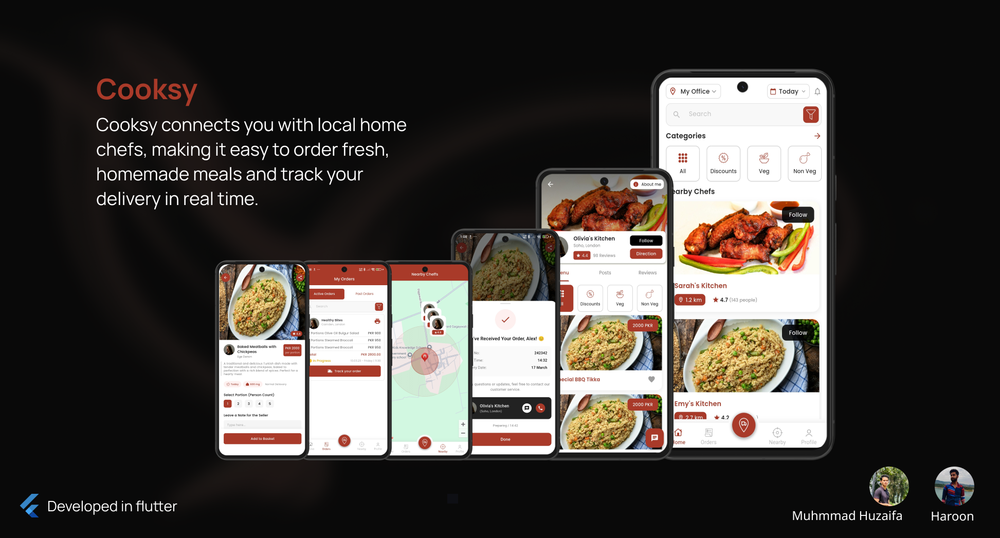

<div align="center">
  
 
</div>

# 🍳 Cooksy

**Cooksy** connects you with local home chefs, making it easy to order fresh homemade meals and track your delivery in real time.  
Built with **Flutter**, Cooksy is your modern food marketplace for homemade happiness.  

---

## 🖼️ Overview

<div align="center">
  
</div>

Cooksy bridges the gap between **home chefs** and **customers**:  

- Customers can **discover nearby chefs**, browse menus, and order homemade meals.  
- Chefs can **list their dishes**, manage orders, and grow their home-based food business.  
- Real-time order tracking keeps everyone updated.  

---

## ✨ Features

- 👨‍🍳 **For Customers**
  - Discover nearby chefs & menus
  - Browse by category (Veg, Non-Veg, Discounts, etc.)
  - Place and track food orders in real-time
  - Rate & review chefs  

- 🍲 **For Chefs**
  - Create and manage dish listings
  - Accept or reject orders
  - Update delivery status
  - Engage with customer feedback  

- 🚀 **General Features**
  - Location-based chef discovery  
  - In-app order management  
  - Favorites & follows for quick access  
  - Clean & modern Flutter UI  

---

## 📱 Screenshots

<div align="center">
  
  
  
  
  
</div>

---

## 🏗️ Tech Stack

- **Frontend:** Flutter (Dart)  
- **Backend:** Firebase / Supabase (customizable)  
- **Database:** Firestore / PostgreSQL  
- **Authentication:** Firebase Auth  
- **Maps & Location:** Google Maps API  
- **Payments:** Stripe / Razorpay (future roadmap)  

---

## 🚀 Getting Started

### Prerequisites
- Install [Flutter SDK](https://docs.flutter.dev/get-started/install)  
- Setup an emulator / connect a device  
- Clone the repository  

### Installation

```bash
git clone https://github.com/haroon1o1/cooksy.git
cd cooksy
flutter pub get
